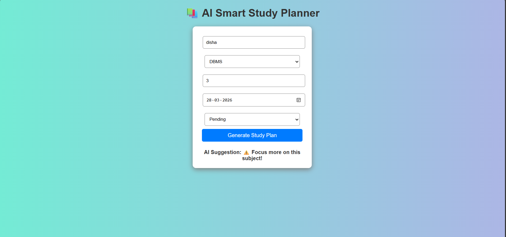
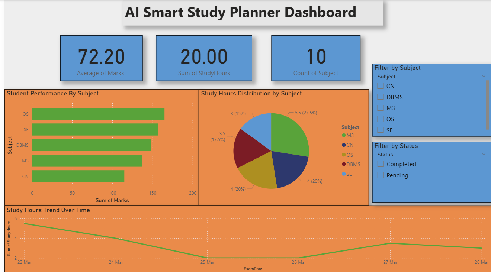

# 📚 AI Smart Study Planner

A smart system to help students plan, analyze, and improve their studies using AI-based logic.

---

## 📌 Project Overview
The AI Smart Study Planner is a prototype system designed to help students manage their study schedule efficiently. It allows users to input study-related data and provides intelligent recommendations along with performance insights through a dashboard.

---

## 🎯 Problem Statement
Many students struggle with:
- Poor time management
- Lack of focus on weak subjects
- No proper performance tracking system

---

## 💡 Proposed Solution
This project provides a smart system that:
- Collects student study data
- Applies rule-based AI logic
- Generates recommendations
- Visualizes performance using an interactive dashboard

---

## ⚙️ Features
- 📥 User Input Interface (HTML form)
- 🤖 AI-based Study Suggestions (JavaScript logic)
- 📊 Performance Dashboard (Power BI)
- 📁 Data Storage (Excel dataset)
- 📈 Visual insights for better decision-making

---

## 🧠 AI Logic Used
The system uses rule-based logic:
- If study hours < 2 → Suggest increasing study time
- If subject status is pending → Focus more
- If performance is good → Maintain consistency

This simulates basic AI decision-making.

---

## 🏗️ System Architecture
User Input → AI Logic Processing → Data Storage → Dashboard Visualization

---

## 🛠️ Technologies Used
- HTML, CSS, JavaScript (Frontend)
- Excel (Data Storage)
- Power BI (Data Visualization)

---

## 📊 Dashboard Insights
The dashboard provides:
- Subject-wise performance analysis
- Study hours distribution
- Study trends over time
- Key performance indicators (average marks, total hours)

---

## 📸 Screenshots

### 🔹 User Interface

### 🔹 Dashboard

---

## 🚀 Future Scope
- Integration with database
- Real-time data connection
- Mobile application development
- Advanced AI/ML-based recommendations

---

## 👥 Team Members
- Disha Gupta
- Shahin khan
- Tripti Tiwari

---

## 📌 Conclusion
This project demonstrates how AI-based logic and data visualization can help students improve their study planning and performance effectively.
